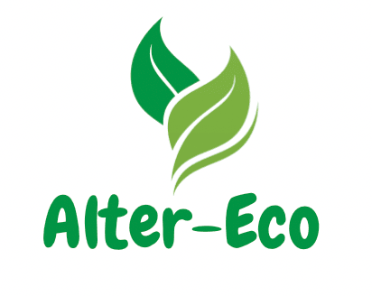

# Alter-Eco

## Motivation
♻️ The purpose of creating Alter-Eco was to inspire and educate children about the importance of sustainable practices and the power of recycling. With Alter-Eco, the responsible disposal of waste can become more instinctive and sustainable, helping to reduce your carbon footprint. 

🌱 Through leveraging gamification and chat room features, users can learn more about recycling in an interactive and engaging way, and communicate with people in their community to promote discussion around eco-friendly practices as well as share proper waste disposal/management locations. 

## Built with: 
* React
* Node.js
* Express
* SocketIO
* Javascript
* HTML
* CSS
* Mustache
* Moment
* QueryString

## Getting started: 

Install dependencies: 

npm install

Run project: 

npm start

The project will deploy to http://localhost:3000

